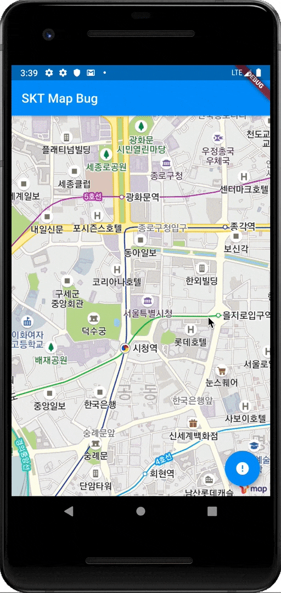

# skt_map_bug



## Reproduction Steps

1. Open `./android/app/src/main/java/com/example/skt_map_bug/MainActivity.java` and replace `PASTE_API_KEY_HERE` with valid API Key.
2. Install Dependencies: `flutter packages get`
3. Run: `flutter run` (Android Only)
4. Wait for map to load and tap floating action button
5. Tap close in top left

Expected: See and be able to interact with map.
Actual: Map turns gray and is no longer interactive.

### Stacktrace

```sh
🔥  To hot reload changes while running, press "r". To hot restart (and rebuild state), press "R".
An Observatory debugger and profiler on Android SDK built for x86 is available at: http://127.0.0.1:57674/UDEq9QftVX4=/
For a more detailed help message, press "h". To detach, press "d"; to quit, press "q".
D/        (11693): HostConnection::get() New Host Connection established 0xc01d9500, tid 11719
D/        (11693): HostConnection::get() New Host Connection established 0xbdb7f100, tid 11872
D/NetworkSecurityConfig(11693): No Network Security Config specified, using platform default
D/EGL_emulation(11693): eglMakeCurrent: 0xde905cc0: ver 3 0 (tinfo 0xc5c36dd0)
D/EGL_emulation(11693): eglMakeCurrent: 0xde905cc0: ver 3 0 (tinfo 0xc5c36dd0)
D/EGL_emulation(11693): eglMakeCurrent: 0xde905cc0: ver 3 0 (tinfo 0xc5c36dd0)
W/System  (11693): A resource failed to call end.
D/EGL_emulation(11693): eglMakeCurrent: 0xde905cc0: ver 3 0 (tinfo 0xc5c36dd0)
D/gralloc_ranchu(11693): gralloc_unregister_buffer: exiting HostConnection (is buffer-handling thread)
D/        (11693): HostConnection::get() New Host Connection established 0xbdb7f100, tid 11872
D/gralloc_ranchu(11693): gralloc_unregister_buffer: exiting HostConnection (is buffer-handling thread)
D/        (11693): HostConnection::get() New Host Connection established 0xbdb7f100, tid 11872
D/gralloc_ranchu(11693): gralloc_unregister_buffer: exiting HostConnection (is buffer-handling thread)
D/        (11693): HostConnection::get() New Host Connection established 0xbdb7f100, tid 11872
D/gralloc_ranchu(11693): gralloc_unregister_buffer: exiting HostConnection (is buffer-handling thread)
D/        (11693): HostConnection::get() New Host Connection established 0xbdb7f100, tid 11872
D/EGL_emulation(11693): eglMakeCurrent: 0xde905cc0: ver 3 0 (tinfo 0xc5c36dd0)
E/Surface (11693): queueBuffer: error queuing buffer to SurfaceTexture, -19
E/EGL_emulation(11693): tid 11855: swapBuffers(552): error 0x300d (EGL_BAD_SURFACE)
W/OpenGLRenderer(11693): swapBuffers encountered EGL error 12301 on 0xde905a20, halting rendering...
D/EGL_emulation(11693): eglMakeCurrent: 0xde905cc0: ver 3 0 (tinfo 0xc5c36dd0)
D/EGL_emulation(11693): eglMakeCurrent: 0xde905cc0: ver 3 0 (tinfo 0xc5c36dd0)
D/gralloc_ranchu(11693): gralloc_unregister_buffer: exiting HostConnection (is buffer-handling thread)
D/        (11693): HostConnection::get() New Host Connection established 0xc01d9500, tid 11719
D/gralloc_ranchu(11693): gralloc_unregister_buffer: exiting HostConnection (is buffer-handling thread)
D/        (11693): HostConnection::get() New Host Connection established 0xc01d9500, tid 11719
D/EGL_emulation(11693): eglMakeCurrent: 0xde905cc0: ver 3 0 (tinfo 0xc5c36dd0)
D/EGL_emulation(11693): eglMakeCurrent: 0xde905cc0: ver 3 0 (tinfo 0xc5c36dd0)

Performing hot restart...                                              ⣟D/EGL_emulation(11693): eglMakeCurrent: 0xde905cc0: ver 3 0 (tinfo 0xc5c36dd0)
E/BufferQueueProducer(11693): [SurfaceTexture-0-11693-0] cancelBuffer: BufferQueue has been abandoned

Restarted application in 1,454ms.
D/        (11693): HostConnection::get() New Host Connection established 0xc63ff0c0, tid 11718
W/System  (11693): A resource failed to call release.
D/EGL_emulation(11693): eglMakeCurrent: 0xde905cc0: ver 3 0 (tinfo 0xc5c36dd0)
D/gralloc_ranchu(11693): gralloc_unregister_buffer: exiting HostConnection (is buffer-handling thread)
D/        (11693): HostConnection::get() New Host Connection established 0xc01d9500, tid 11719
D/gralloc_ranchu(11693): gralloc_unregister_buffer: exiting HostConnection (is buffer-handling thread)
D/        (11693): HostConnection::get() New Host Connection established 0xc01d9500, tid 11719
D/gralloc_ranchu(11693): gralloc_unregister_buffer: exiting HostConnection (is buffer-handling thread)
D/        (11693): HostConnection::get() New Host Connection established 0xc01d9500, tid 11719
D/gralloc_ranchu(11693): gralloc_unregister_buffer: exiting HostConnection (is buffer-handling thread)
D/        (11693): HostConnection::get() New Host Connection established 0xc01d9500, tid 11719
D/        (11693): HostConnection::get() New Host Connection established 0xbdb7f040, tid 11716
E/Surface (11693): queueBuffer: error queuing buffer to SurfaceTexture, -19
E/EGL_emulation(11693): tid 11855: swapBuffers(552): error 0x300d (EGL_BAD_SURFACE)
W/OpenGLRenderer(11693): swapBuffers encountered EGL error 12301 on 0xde905a20, halting rendering...
D/EGL_emulation(11693): eglMakeCurrent: 0xde905cc0: ver 3 0 (tinfo 0xc5c36dd0)
D/EGL_emulation(11693): eglMakeCurrent: 0xde905cc0: ver 3 0 (tinfo 0xc5c36dd0)
D/gralloc_ranchu(11693): gralloc_unregister_buffer: exiting HostConnection (is buffer-handling thread)
D/        (11693): HostConnection::get() New Host Connection established 0xbdb7f040, tid 11716
D/gralloc_ranchu(11693): gralloc_unregister_buffer: exiting HostConnection (is buffer-handling thread)
D/        (11693): HostConnection::get() New Host Connection established 0xbdb7f040, tid 11716
D/        (11693): HostConnection::get() New Host Connection established 0xbd875ac0, tid 12020
E/Surface (11693): queueBuffer: error queuing buffer to SurfaceTexture, -19
E/EGL_emulation(11693): tid 11855: swapBuffers(552): error 0x300d (EGL_BAD_SURFACE)
W/OpenGLRenderer(11693): swapBuffers encountered EGL error 12301 on 0xde905a20, halting rendering...
D/EGL_emulation(11693): eglMakeCurrent: 0xde905cc0: ver 3 0 (tinfo 0xc5c36dd0)
D/EGL_emulation(11693): eglMakeCurrent: 0xde905cc0: ver 3 0 (tinfo 0xc5c36dd0)
```
